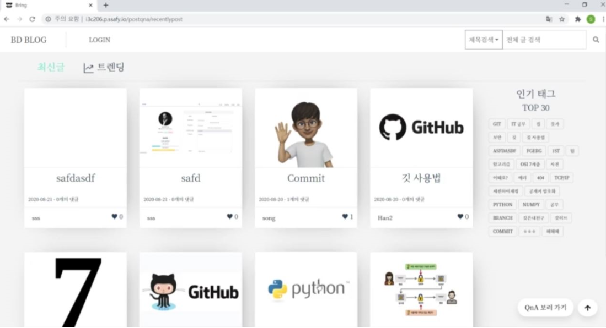
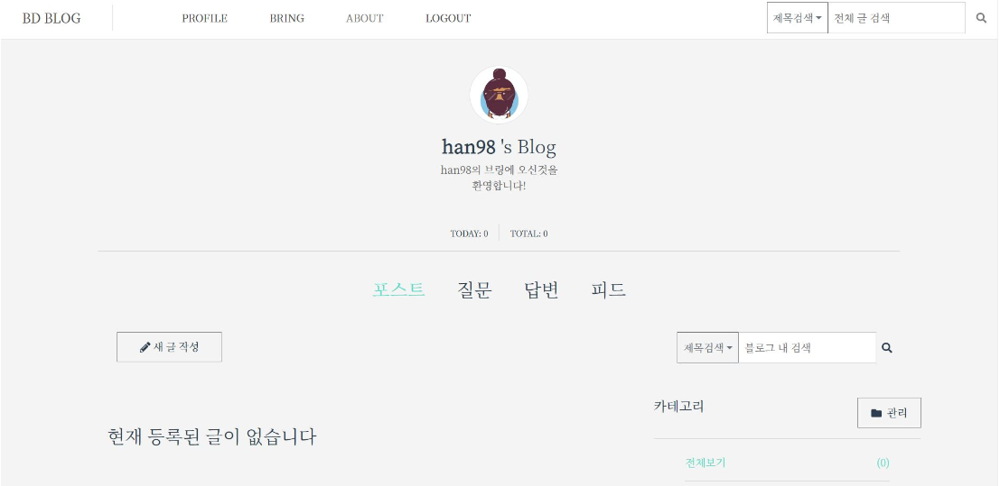
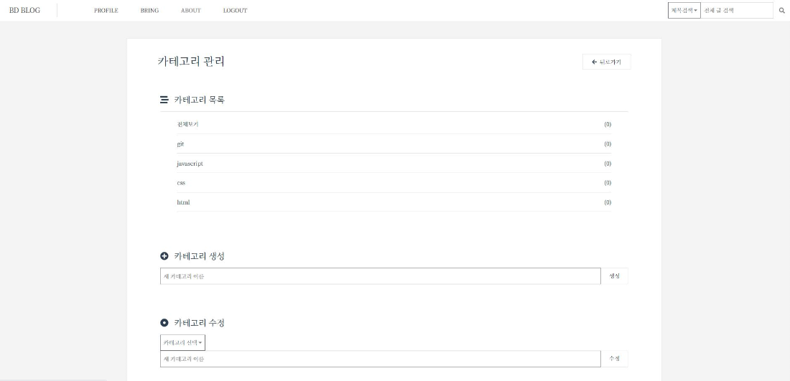
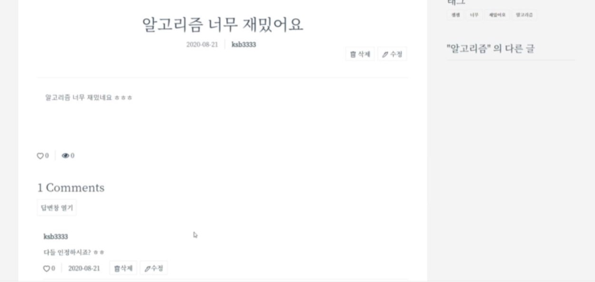
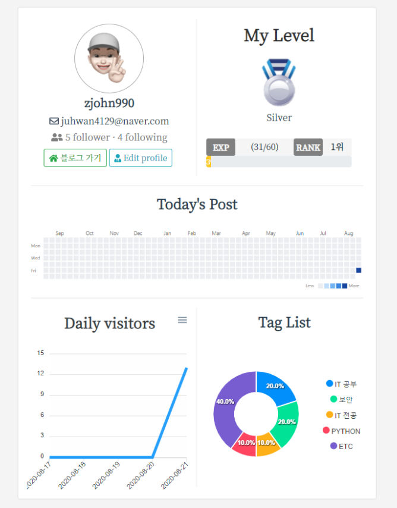
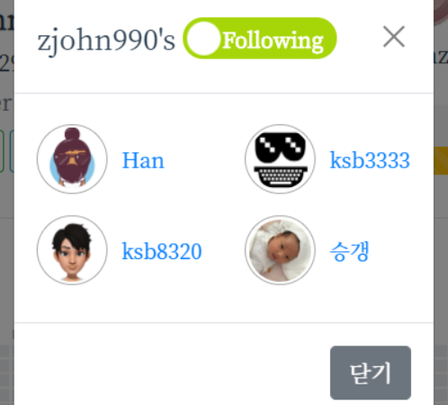
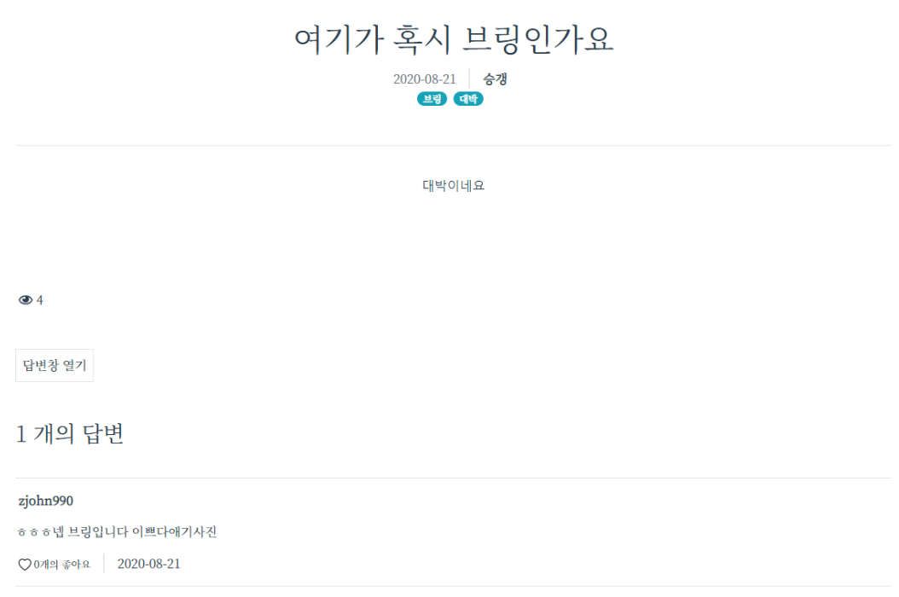
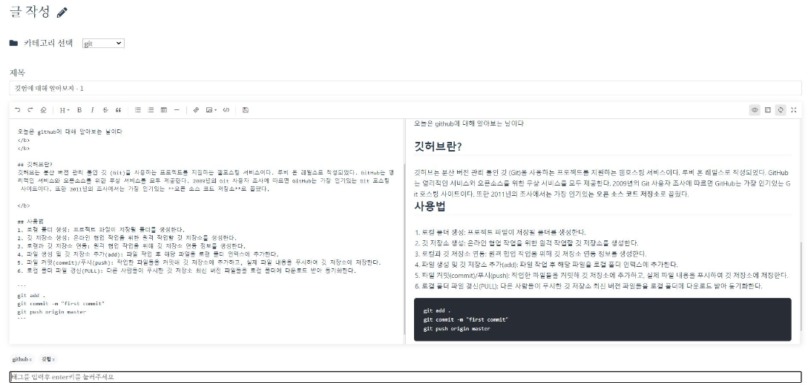
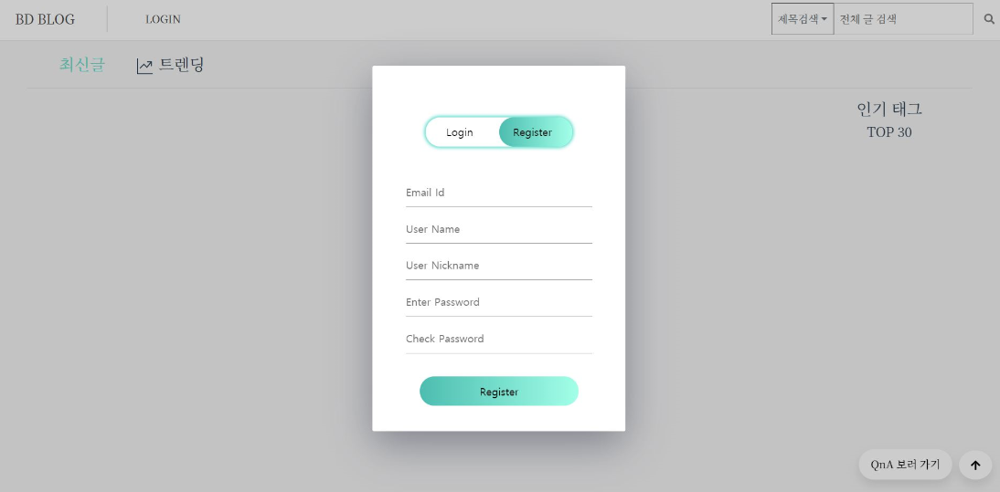

# Blog for developers(개발자 블로그)

## 목차

- [개요](#개요)
- [기능](#기능)
- [유사 서비스](#유사-서비스) 
- [향후 전망](#향후-전망)
- [기술 스택](#기술-스택)
- [기술 설명](#기술-설명)
  - [ERD](#erd)
  - [디렉토리 구조도](#디렉토리-구조도)
  - [기타](#기타)

## 개요

### 기간

2020.07 ~ 2020.08 (약 5주)


### 목적

- 개발자들을 위한 **블로그**와 **지식인** 기능을 가지는 웹 서비스 구현 
- 등급을 도입하여 유저들의 경쟁심을 자극, 개발 지식을 지속적으로 공유하고 질문하도록 유도 
- 개인 블로그 CRUD와 질문, 답변 기능 CRUD 등 구현


### 역할 및 기여도

- 팀원: 5명

- 역할: 프론트엔드(팀원)

- 기여도: 약 20%
  - 블로그 전체 페이지, 블로그 글 상세페이지, 카테고리 관리, 글 작성 페이지 구현
  - 좋아요 기능 구현
  - 키워드 검색, 태그 검색 구현


## 주요 기능

1. 메인페이지 & 헤더
   - 블로그 포스트 최신글(14일 이내) 목록
   - 블로그 포스트 트렌드(인기글, 조회수 40이상 or 추천수 20개 이상, 14일 이내) 목록
   - Q&A 최신글(14일 이내) 목록
   - Q&A 트렌드(인기글, 조회수 40 이상 or 답변 수 1 이상,14일 이내) 목록
   - 태그 검색 기능 및 인기 태그 Top 30 목록
   - 전체 글 검색(제목, 작성자, 내용 필터링)




2. 블로그 메인 페이지
   - 유저의 블로그 글 목록
   - 유저의 질문 글 목록
   - 유저의 질문에 대한 답변 글 목록
   - 유저가 팔로우 한 사람들의 최신 피드 정보(자신의 블로그에서만 확인 가능)
   - 키워드 검색, 태그 검색 등의 필터링으로 유저 글 검색
   - 새 글 작성 버튼(카테고리 없을 시,  카테고리 생성 유도 모달)
   - 카테고리 관리 버튼
   - 유저가 생성한 카테고리 목록
   - 페이지네이션




3. 카테고리 관리
   - 카테고리 CRUD
   - 카테고리 삭제 시에는 해당 카테고리 글 전부 삭제된다는 모달 창 확인




4. 블로그 글 상세페이지
   - 글 작성자만 글 삭제 및 수정 가능
   - 댓글 CRUD
   - 글 & 댓글 좋아요 기능
   - 태그 목록
   - 해당 글과 같은 카테고리 안에 있는 다른 글 목록




5. 유저 프로필
   - 회원 정보 수정 및 프로필 사진 등록
   - 해당 유저 블로그로의 이동 버튼
   - 타 유저 팔로우, 팔로워 및 팔로잉 목록
   - 유저 등급과 랭킹 정보 제공
   - calender-heatmap으로 유저 활동 시각화
   - 일일 방문자 그래프
   - 태그 사용 목록 및 그래프






6. 질문 상세페이지
   - 질문 태그 목록
   - 답변 CRUD, 좋아요 기능
   - 글 작성자만 답변 채택 가능
   - 답변 채택 시, 해당 답변 작성한 유저에게 일정 점수 부여
   - 채택된 답변 우선 노출




7. 글 작성
   - 카테고리 선택
   - 사진 업로드
   - 태그 작성




8. 인증 페이지
   - 로그인, 회원가입, 로그아웃




## 유사 서비스

1. Velog

   - 질문 기능, 채택 기능 등 없음

   - 지속적인 참여(기여도) 촉진할 요소 부족

     

2. Stack Overflow

   - 개인 블로그 기능 없음


## 향후 전망

1. 에디터
   - 마크다운 에디터를 직접 개발하지 않고 다른 모듈을 가져와서 사용하였음, 서비스에 맞게 개발 필요


2. 글 퍼오기 기능
   - 다른 유저가 쓴 글을 퍼오기 하여 나의 블로그에 띄우는 기능 보완 필요


## 기술 스택

- CI/CD: Nginx, GitLab CI/CD
- Server: AWS EC2, Docker
- Storage: AWS S3(CloudFront)
- DB: Mariadb(Docker), Reids(Docker), JPA
- Back-end Framework: Spring Boot
- Front-end: Vue js, axios
- Library: Spring Security, OAuth2.0(JWT)


## 기술 설명

### ERD


### 디렉토리 구조도

- 프론트엔드

  ```
  .
  ├─ .gitignore
  ├─ README.md
  ├─ babel.config.js
  ├─ package-lock.json
  ├─ package.json
  ├─ yarn.lock
  ├─ public
  │   ├─ favicon.ico
  │   └─ index.html
  └─ src
     ├─ main.js
     ├─ App.vue
     ├─ event-bus.js
     ├─ components        컴포넌트
     │  ├─ blog
     │  ├─ common
     │  └─ user
     ├─ router            라우터
     │  └─ index.js
     ├─ views             라우터 페이지
     │  ├─ index.vue
     │  ├─ question
     │  ├─ blog
     │  ├─ post
     │  └─ user
     └─ assets            css 등의 웹 자원
        ├─ logo.png
        └─ img
  ```
  
  

### 기타

